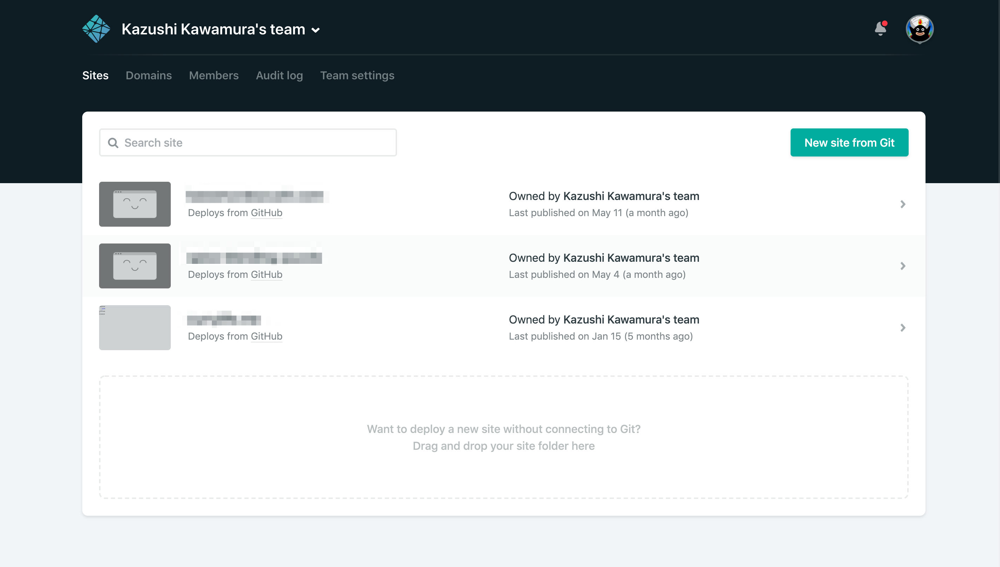
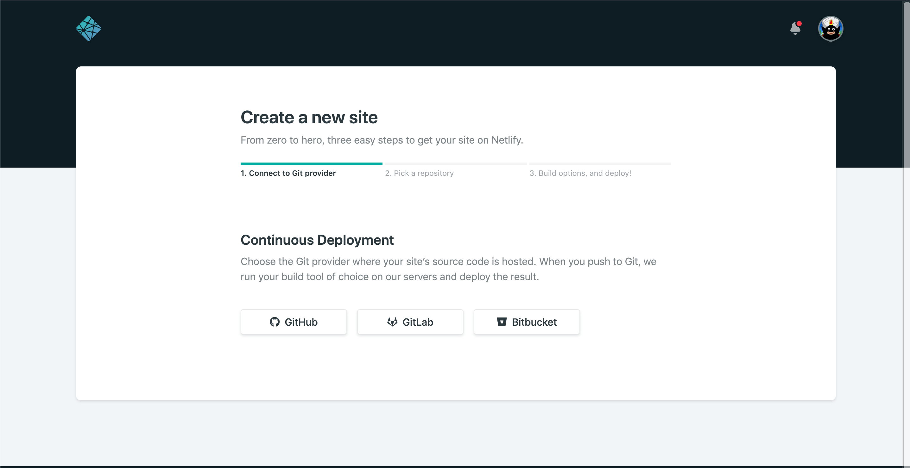
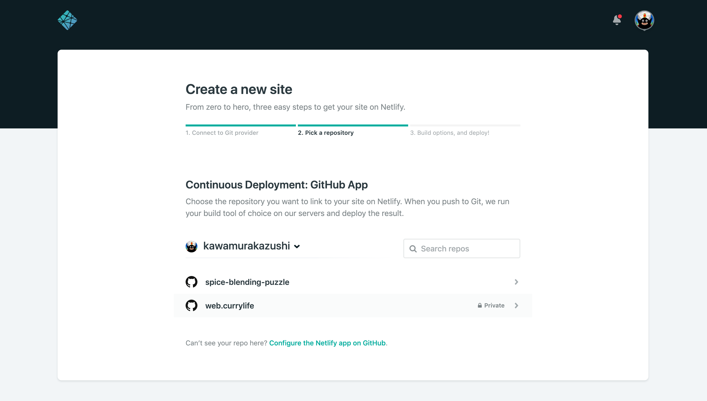
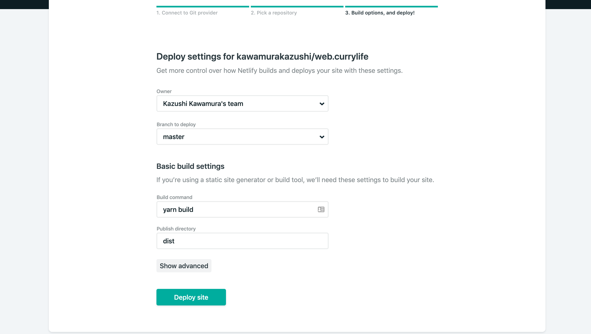

## About netlify

On my previous article we setup an development environment for elm application using parcel.

Next we have to think about deploying the site. There're several options, but one of the easiest way for a SPA is by using Netlify.

Netlify is basically a hosting service for static sites, but additionally it includes continuous integration, automatic HTTPS support, and bunch of other interesting features for free.

I will walk you through deploying the site, and show you how easy it is to deploy an elm application.

## Signing up Netlify

First of all you'll have to create an account on Netlify.

You can create your account here : [https://app.netlify.com/signup](https://app.netlify.com/signup)

## Creating the repository

You'll need a dedicated github (or gitlab / bitbucket) repository for the project.

Push your latest elm application code to your repository.

```
git add -A
git commit -m "Initial Commit"
git push origin master
```

## Making the build scripts

You'll have to create a build script, to generate `html` , `js` and `css` from the elm code.

If you are using parcel it is very simple: `yarn parcel build src/index.html`, and you're done.

It is a good practice to add it to your `package.json`'s scripts. It will look like as follows:

```
{
  "name": "Elm Sample Application",
  "version": "1.0.0",
  "main": "index.js",
  "license": "MIT",
  "devDependencies": {
    "elm-hot": "^1.0.1",
    "node-elm-compiler": "^5.0.3",
    "parcel-bundler": "^1.12.3",
  },
  "scripts": {
    "start": "parcel src/index.html",
    "build": "parcel build src/index.html"
  }
}
```

## Setting up Netlify

Next is setting up netlify.

After you have logged In, Click on "New site from Git", then you're almost done.



Choose your Git provider; for me it will be Github.



Pick your repository:



Then last but not least, you have to add two configuration.

1 - Build commands

For this you will write the script that you have wrote on `package.json` , which is `yarn build`

2 - Publish directory

Parcel will build inside `dist` directory by default, so just write `dist`.



Click on "Deploy site" and you're done.

## Setting up redirects

One last things that you'll need to set up is the redirects for SPA.
Since all the routing is done by the client side, the server needs to redirect to the root for every request.

Which means all the path needs to be redirected to index.html.

To configure you'll need to create `netlify.toml` file on the root of the project, and write as follows:

```
[[redirects]]
  from = "/*"
  to = "/index.html"
  status = 200
```

Commit and push your code, and Netlify will automatically configure the server for you.

## Summary

This is how easy it is to deploy a SPA using Netlify.

The pricing is great for hosting personal projects, hobby sites, or experiments. It's free for the basic features, and 100GB of bandwidth.

This blog is also hosted on Netlify :D

you can check for details of the pricing here:

[https://www.netlify.com/pricing/](https://www.netlify.com/pricing/)