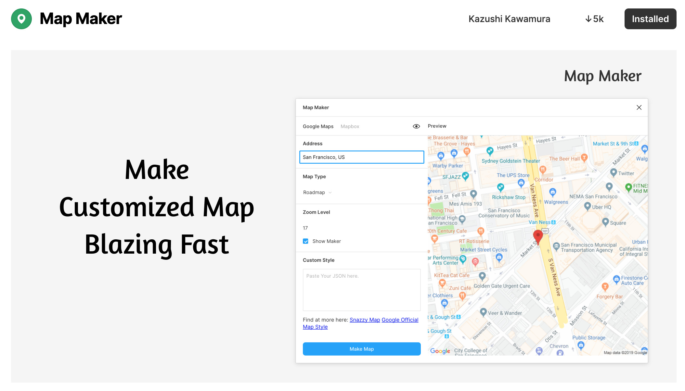
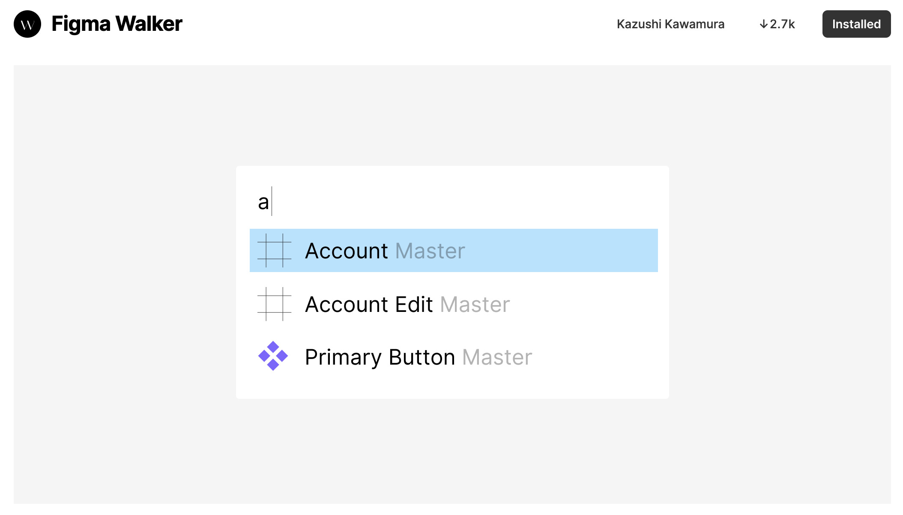
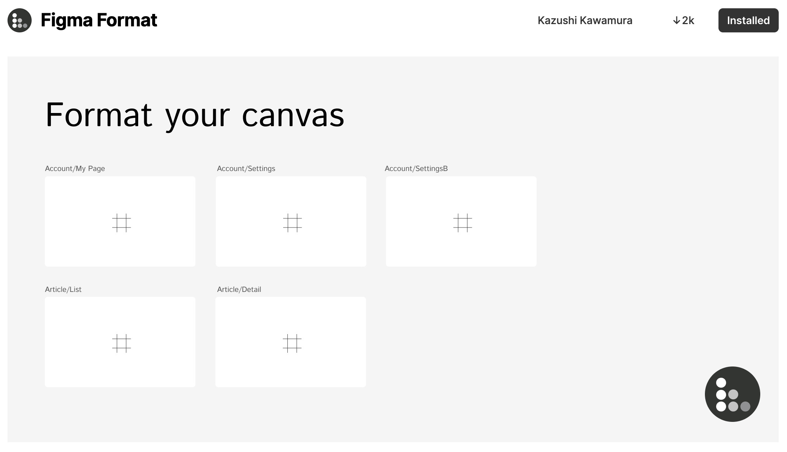
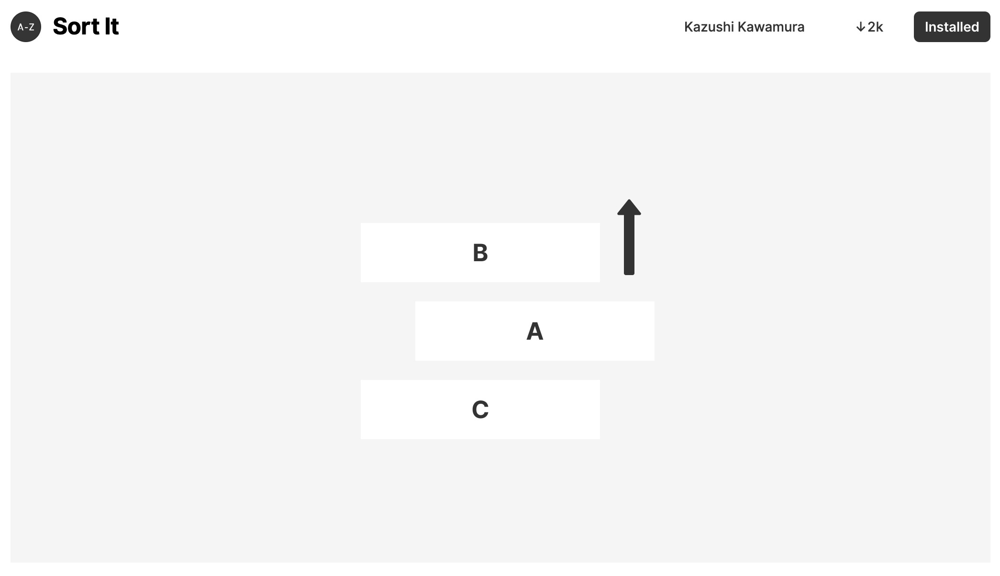

I participated in Figma Plugin Beta program, and I made **4** plugins during that period.

I'd like to share what I have made.

## Map Maker



Map Maker is a plugin that generates map blazing fast, so you will not have to take a screenshot.

Currently it supports two map provider which is **Google Maps** and **Mapbox**. And I am hoping I'll have some time to support more providers including Apple Maps and Bing Map.

There's many customization possible including _Zoom Level_, _Adding pins_, _Map styles_, and more.

Another benefit is you can edit the generated map, so if you have made some mistake with the address, or if you want to change zoom level of the map, you can do so using this Plugin.

### If you are interested in Map Maker

🔗[Install in Figma](https://www.figma.com/c/plugin/731312569747199418/Map-Maker) / 🖥[View in Github](https://github.com/kawamurakazushi/figma-map-maker)

## Figma Walker



Figma Walker is a launcher for figma, where you can take many actions with a single input field.

1. Search Frames / Components / Pages and jump to that location.
1. Inserting components
1. Creating Component from a selected nodes.

And currently developing more features like, applying local styles, applying boolean operations like union, subtract and a lot more..

### If you are interested in Figma Walker

🔗[Install in Figma](https://www.figma.com/c/plugin/732773762837487095/Figma-Walker) / 🖥[View in Github](https://github.com/kawamurakazushi/figma-walker)

## Figma Format



Figma Format is like a code formatter but for figma.

If you follow the convention of the names, no matter how you place your frames, it will automagically formats you canvas.

### If you are interested in Figma Format

🔗[Install in Figma](https://www.figma.com/c/plugin/732774680197470712/Figma-Format) / 🖥[View in Github](https://github.com/kawamurakazushi/figma-format)

## Sort It



Sort it is a simple plugin that sorts any layers (including nested nodes) alphabetically.

I'd like to share the code, for this plugin, because it's super short and simple.

You will get the selected nodes from the `figma` global variable, and sort using `localeCompare` from javascript.

```javascript
const sorted = figma.currentPage.selection
  .map(node => {
    const parent = node.parent;
    startingIndex = Math.min(startingIndex, parent.children.indexOf(node));
    return {
      node,
      parent,
    };
  })
  .sort((a, b) =>
    figma.command === "desc"
      ? a.node.name.localeCompare(b.node.name, undefined, {
          numeric: true,
        })
      : b.node.name.localeCompare(a.node.name, undefined, {
          numeric: true,
        })
  )
  .forEach((obj, i) => {
    obj.parent.insertChild(startingIndex + i, obj.node);
  });
```

### If you are interested in Sort It

🔗[Install in Figma](https://www.figma.com/c/plugin/731324768889901500/Sort-It) / 🖥[View in Github](https://github.com/kawamurakazushi/figma-sort-it)

## Summary

The beta program was a great experience.

Figma Plugin API was very straightforward and the development experience was a ease.

Hope to find more mind blowing plugins on Figma!
