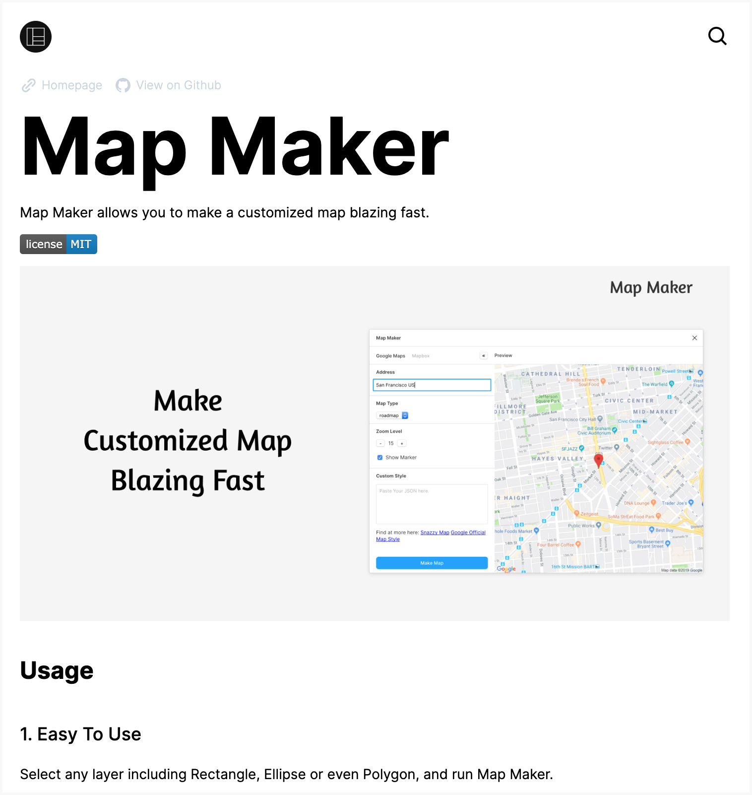
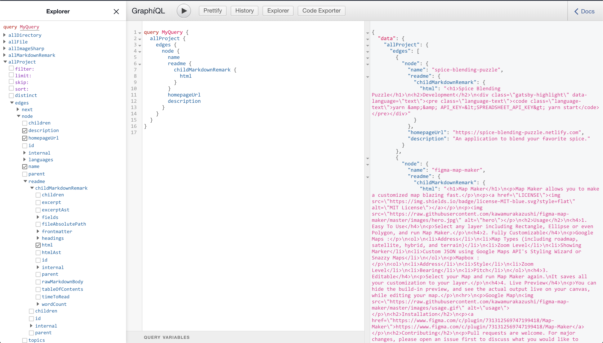

## Introduction

Recently I published a few pages about my side projects in my websites, for instance [Figma Map Maker](/projects/figma-map-maker) and [Thyme](/projects/thyme).

All of my side projects are managed in Github, and I didn't want to double manage both my website project page, and my project's README.

I decided to use the information in the Github README to fill the information of the project on my website, then I'll only need to polish my README files on Github.

To accomplished this I could either fetch the contents of README using the Github API on the client-side, or generate a page leveraging Gatsby's API.

I picked the latter, to have a blazing fast experience on my website.

You can see the final code [Here](https://github.com/kawamurakazushi/.com/blob/master/gatsby-node.ts).

## Goal

My Goal is to provide an array of github repository names like this,

```javascript
const projects = ["spice-blending-puzzle", "figma-map-maker", "thyme"];
```

And automagically generates pages with the following path `/projects/spice-blending-puzzle`, `/projects/figma-map-maker`, and `/projects/thyme`, with the all the contents, including README.

Like this:


### Steps

The Steps are first to **create nodes from the information fetched from Github API**, and **using those nodes to generate the pages**.

Thats basically it.

## Create Nodes

We need to tell Gatsby to create node during the bootstrapping sequence. To do so we need to define the hook called `sourceNodes` in your `gatsby-node.js` and create your own custom node. It will be called only once during the sequence.

```javascript
// gatsby-node.js

exports.sourceNodes = ({ actions, createNodeId, createContentDigest }) => {
  const { createNode } = actions;
  // Data can come from anywhere, but for now create it manually
  const myData = {
    key: 123,
    foo: `The foo field of my node`,
    bar: `Baz`,
  };

  const nodeContent = JSON.stringify(myData);
  const nodeMeta = {
    id: createNodeId(`my-data-${myData.key}`),
    parent: null,
    children: [],
    internal: {
      type: `MyNodeType`,
      mediaType: `text/html`,
      content: nodeContent,
      contentDigest: createContentDigest(myData),
    },
  };

  const node = Object.assign({}, myData, nodeMeta);
  createNode(node);
};
```

This is an example written in the docs [Here](https://www.gatsbyjs.org/docs/node-apis/#sourceNodes).

We will be modifying this to create the node for my github repositories.

### Github API

We will be using [Github GraphQL API v4](https://developer.github.com/v4/) to fetch the contents of the repository.

Finish your [authentication](https://developer.github.com/v4/guides/forming-calls/#authenticating-with-graphql), and you are ready to start.

To call GraphQL queries from Javascript it better to use a GraphQL Client like Apollo, and since `gatsby-node.js` is Node and runs on the server we need `node-fetch`.

```bash
yarn add apollo-boost node-fetch
```

Use the apollo client to fetch information from Github, such as _name_, _description_, _raw README_ and etc...

Inside the sourceNodes function, map each name of the repositories, and try to fetch the information. Keep in mind it will return an array of Promises since callback function of map is async.

```js
// gatsby-node.js

import ApolloClient from "apollo-boost";

export const sourceNodes = async ({
  actions,
  createNodeId,
  createContentDigest,
}: SourceNodesArgs) => {
  require("dotenv").config();
  const { createNode } = actions;
  const nodes = [
    "spice-blending-puzzle",
    "figma-map-maker",
    "figma-walker",
    "figma-format",
    "figma-sort-it",
    "vscode-grep",
    "seo-editor",
    "thyme",
  ].map(async p => {
    const client = new ApolloClient({
      fetch: require("node-fetch"),
      headers: {
        Authorization: `Bearer ${process.env.GITHUB_API_KEY}`,
      },
      uri: "https://api.github.com/graphql",
    });

    const response = await client.query({
      query: gql`
        query Repository($name: String!) {
          repository(owner: "kawamurakazushi", name: $name) {
            name
            description
            url
            homepageUrl
            repositoryTopics(first: 5) {
              edges {
                node {
                  topic {
                    name
                  }
                }
              }
            }
            object(expression: "master:README.md") {
              ... on Blob {
                text
              }
            }
            languages(first: 5) {
              edges {
                node {
                  name
                  color
                }
              }
            }
          }
        }
      `,
      variables: { name: p },
    });

    // TODO: Create Node
  });
};
```

Next we need to create Node depending on the response.

### Using the remark to convert Markdown to HTML

The Github API only returns raw README, which is normally markdown, so to display we need to convert it to HTML.

We can convert it in the client side, but we can use the `gatsby-transformer-remark` plugin to convert it.

To do so we have to create two nodes, One is the `parentNode` which contains the main data, like the _title_, and _description_, and then `readmeNode` whose parent is the `parentNode`.

The `readmeNode`'s `mediaType` is 'text/markdown', which is hooked to the `gatsby-transformer-remark` plugin, gaining ability to get HTML plus other useful features.

The code looks like this:

```js{39-90}
// gatsby-node.js

import ApolloClient from "apollo-boost";

export const sourceNodes = async ({
  actions,
  createNodeId,
  createContentDigest,
}: SourceNodesArgs) => {
  require("dotenv").config();
  const { createNode } = actions;

  const nodes = [
    "spice-blending-puzzle",
    "figma-map-maker",
    "figma-walker",
    "figma-format",
    "figma-sort-it",
    "vscode-grep",
    "seo-editor",
    "thyme",
  ].map(async p => {
    const client = new ApolloClient({
      fetch: require("node-fetch"),
      headers: {
        Authorization: `Bearer ${process.env.GITHUB_API_KEY}`,
      },
      uri: "https://api.github.com/graphql",
    });
    const response = await client.query({
      query: gql`
        query Repository($name: String!) {
          //...
        }
      `,
      variables: { name: p },
    });

    const repository = response.data.repository;

    const parentId = createNodeId(`project/${repository.name}`);
    const readmeId = createNodeId(`project/${repository.name}/readme`);

    const nodeData = {
      description: repository.description,
      homepageUrl: repository.homepageUrl,
      languages: repository.languages.edges.map(({ node }) => node),
      name: repository.name,
      topics: repository.repositoryTopics.edges.map(
        ({ node }) => node.topic.name
      ),
      url: repository.url,
    };

    const parentNode: NodeInput = {
      children: [],
      id: parentId,
      internal: {
        contentDigest: createContentDigest(nodeData),
        type: "project",
      },
      parent: undefined,
      readme___NODE: readmeId,
      ...nodeData,
    };

    const readme = repository.object.text.replace(
      /!\[(.*?)\]\((.*?)\)/g,
      (match, alt, img) => {
        if (img.includes("http")) {
          return match;
        }
        return ``;
      }
    );

    const readmeNode: NodeInput = {
      children: [],
      id: readmeId,
      internal: {
        content: readme,
        contentDigest: createContentDigest(readme),
        mediaType: `text/markdown`,
        type: "projectReadme",
      },
      parent: parentId,
    };

    return [parentNode, readmeNode];
  });

  // Finally return a promise that creates all the Node.
  return new Promise(async (resolve, _) => {
    for (const [parentNode, readmeNode] of await Promise.all(nodes)) {
      createNode(parentNode);
      createNode(readmeNode);
    }
    resolve();
  });
};
```

### Check the data in GraphQL Explorer

Let's check the GraphQL Explorer, to see if we can really fetch the informations.



## Creating Page

Next it's time to create the pages.

You will define [createPages](https://www.gatsbyjs.org/docs/node-apis/#createPages) hook in your `gatsby-node.js`. Let's get straight into the code.

```js
// gatsby-node.js

export const createPages = ({ graphql, actions }: CreatePagesArgs) => {
  const { createPage } = actions;

  return new Promise((resolve, _) => {
    graphql(`
      {
        allProject {
          edges {
            node {
              id
              name
            }
          }
        }
      }
    `).then(result => {

      result.data.allProject.edges.forEach(({ node }) => {
        createPage({
          component: path.resolve(`./src/templates/project.tsx`),
          context: {
            id: node.id,
          },
          path: `projects/${node.name}`,
        });
      });

      resolve();
    });
  });
```

It uses the `creatPage` function from `actions`, and for each result from the GraphQL response it will create Page for you with the path `projects/${node.name}`!

## Summary

From now on If i made a new side project in Github, I will only need to add the repository name to `gatsby-node.js` and build again.
This not just save time, but it's also good for my Github Repository since I'll will spend some time writing README :D.

You can see the all the code from `gatsby-node.js` Here. (Although it's Typescript)
