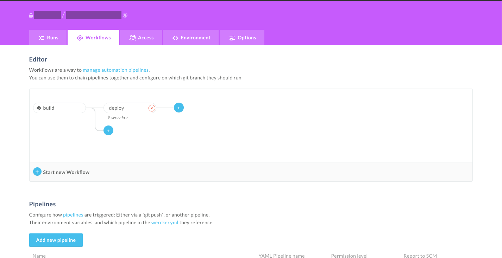
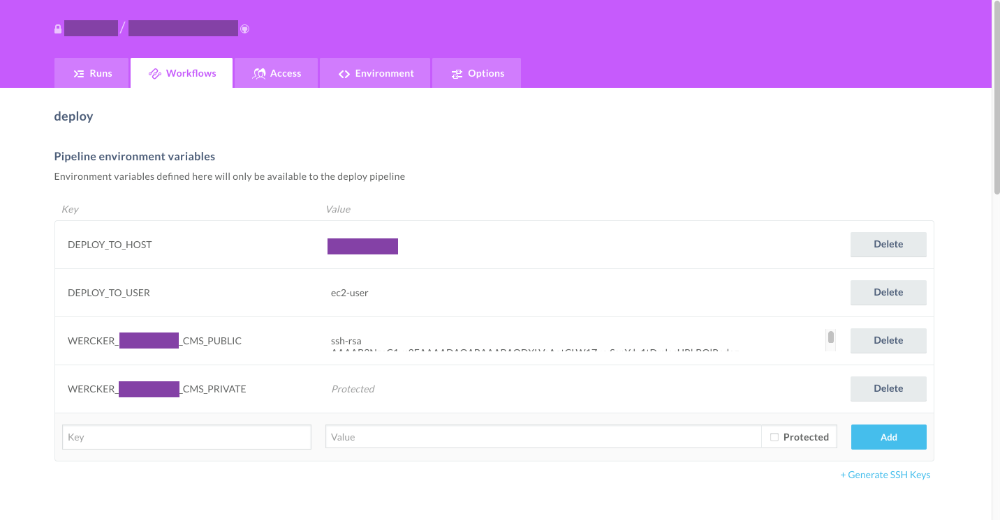

## Introduction

I'd like to introduce how I deployed an Javascript application using [wercker](https://app.wercker.com/).

Note that, this is not a ideal way of deploying production code.

## 1. Create new pipeline for deploy.

In the **Workflows** tab, create a new pipeline called `deploy`.

Select a branch that you want your deploy pipeline to trigger. In this example, I made it trigger on `wercker` branch. But it can be anything, for example `master` /  `staging` depending on your development flow.



## 2. Add `DEPLOY_HOST` `DEPLOY_TO_USER` and generate SSH Key.

Next in your edit your `deploy` pipeline. Add some pipeline specific environment variables.

- `DEPLOY_HOST` -> Your server's  IP Address
- `DEPLOY_TO_USER` -> Your server's user to ssh to. For AWS EC2 Instance, by default it is `ec2-user`
- `<PROJECT_NAME>_PUBLIC` / `<PROJECT_NAME>_PRIVATE` -> This will be generate by clicking *Generate SSH Keys* on the bottom right.




All the setup is complete on wercker.


## 3. Add the public key to the server's `~/.ssh/authorized_keys`

You need to do this, in order to `scp` from wercker.

ssh in to your server, and modify your authorized_keys.

```bash
ssh <user>@<server-ip-address>
echo "<PASTE YOUR GENERATED PUBLIC KEY HERE" >>  ~/.ssh/authorized_keys
```

## 4. Create `wercker.yml`

At last you will need to write `wercker.yml` to write the deployment steps.

```yaml
build:
# ...
deploy:
  steps:
    - add-to-known_hosts:
      hostname: $DEPLOY_TO_HOST

    - add-ssh-key:
      keyname: <PROJECT_NAME> # Name of the generated key.

    - script:
      name: compress
      code: |
        tar -zcvf app.tar.gz /pipeline/source/* --warning=no-file-changed
    - script:
      name: scp
      code: |
        scp -r ./app.tar.gz $DEPLOY_TO_USER@$DEPLOY_TO_HOST:/home/ec2-user/app.tar.gz

    - script:
      name: uncompress
      code: |
        ssh $DEPLOY_TO_USER@$DEPLOY_TO_HOST "rm -rf app && mkdir app && tar -xvf app.tar.gz -C app"

    # This depends on your application. In this example I used forever to start the application.
    - script:
      name: restart server
      code: |
        ssh $DEPLOY_TO_USER@$DEPLOY_TO_HOST "cd app/pipeline/source && yarn forever stopall && NODE_ENV=production yarn start:prod"
```

Done! Every time the code is pushed / merged in your specified branch, it will run the pipeline, and deploy.

## Some lesson learned...

### `killall` command

`killall` returns, and error (stdout 1), when there is no process running, from the argument.
And since most of the CI relies on the stdout whether the command pass or fail, it's quite annoying when you don't want it to fail.


```bash
# if there is no node
killall node
echo $?
1

killall -q node
echo $?
1
```

So the trick will be, piping `||` with a never failing command like `echo`

```bash
killall node || echo 'no process running'
echo $?
0

```

### `forever` command

Using `—-uid` option is quite convenient, when you just want quite 1 forever process.

```
forever start --uid "$NODE_ENV" -a build/server.js
forever stop $NODE_ENV
```
