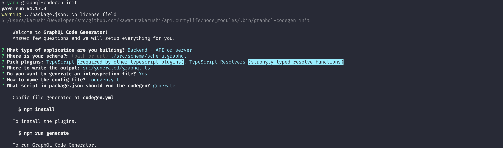

## Problems

When working with graphql server, with the schema first approach, you would normally need to define your types in your graphql schema and also in your code (In this example Typescript).

But that's very tedious, and you might get it wrong, since it's a human sync between the schema and the types in your code, ending up it a very fragile system and difficult to maintain.

But by using [graphql-codegen](https://graphql-code-generator.com/), You can solve it.

This will generate some **useful** types from your schema. Meaning you can use the type of resolver out of the box.

## How to use.

First install some dependencies.

```bash
yarn add -D @graphql-codegen/cli @graphql-codegen/introspection @graphql-codegen/typescript @graphql-codegen/typescript-resolvers
```

And run the `init` cli command.

```bash
yarn graphql-codegen init
```

Please follow the questions.




This will generate a `codegen.yml`, and adds a script to generate your types in `package.json`.

```yml
# codegen.yml

overwrite: true
schema: "./src/schema/schema.graphql"
documents: null
generates:
  src/generated/graphql.ts:
    plugins:
      - "typescript"
      - "typescript-resolvers"
  ./graphql.schema.json:
    plugins:
      - "introspection"
```

In this example, I put the path of the actual schema file on the `schema` attribute since it's a server code, but you can also the write the path of the graphql introspect, usually `/introspect` if you want to do so.


```json
// package.json

{
  //..
  "scripts": {
    "generate": "graphql-codegen --config codegen.yml"
  }
}
```

Then by using the `yarn generate` command that is created from the `init`, you can generate the types from your schema.

```bash
yarn generate
```

You would also like to gitignore your generate files, and also add the generate command to your `postinstall` script, so you or other team member will not forget to generate the types.

```json{4}
{
  //..
  "scripts": {
    "postinstall": "yarn generate",
    "generate": "graphql-codegen --config codegen.yml"
  }
}
```

## Using the generated types

Finally you can type your resolvers in your project.

```typescript
import {
  IResolvers,
  QueryResolvers,
  MutationResolvers,
} from "../../../generated/graphql";

interface Context {};

const Query: QueryResolvers<Context> = {};

const Mutation: MutationResolvers<Context> = {};

export const resolvers: IResolvers<Context> = {
  Query,
  Mutation
};
```

Now you don't need to re-type the arguments of your query and mutation, and it will tell you when it is wrong.

## Summary

This time I only covered for the server code, but this library can be used for client side code, by using plugin for graphql-codegen. so that you can type your request queries.

But just for server side, it will save you lots of time, and reduce human errors.
