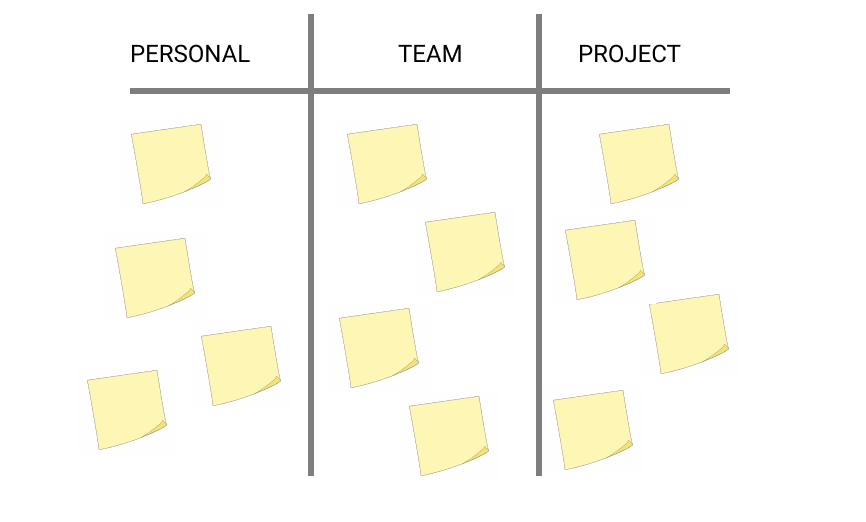

## Introduction

In Scrum, one of the events in the Sprint is **Sprint Retrospective**.

There are a lot of exercise in the internet that can be done during the Retrospective, and I've done couple of interesting ones, but the one I experienced today was quite unique so I want to jot it down before I forget.

The main Goal was to **understand what everyone will be doing on a Personal, Team and Project Level for this week.**

## The Exercise

The exercise is very simple. It is to list down the things you will or want to do in the Next Sprint.

And it has to be in three categories.

- Something for Me.
- Something for the Team.
- Something for the Project.

The time frame for this exercise was *10 minutes*, and was bit longer than other retrospective.



And after, we each present what they you have wrote, and group similar ones on the whiteboard.

When listening to another members present, try to think of the **solutions**.

For example, when someone said.

```
I want to communicate more with the development team more, sync complicated tasks.
```

Then we should think and ask on how we can improve the communication. Should we have more meeting? Or should we do Daily Standups (if we are not doing it.)

After everyone has finished presented we summarized the whiteboard, and try to list the important things that we should definitely do on the next sprint.


## Summary

After this meeting, I thought about why our Scrum Master chose this exercise, and what was the main purpose.
And I thought of several reasons.

- Since it was the first sprint of this project it was important to let everyone think about what their responsibility is.
- To think and care more about the team and the project.
- To know what people think their roles/responsibilities are, and if needed give the advise and solutions.
- To accelerate the next sprint on what to do, since the current sprint wasn't excellent.

Thanks for reading.

