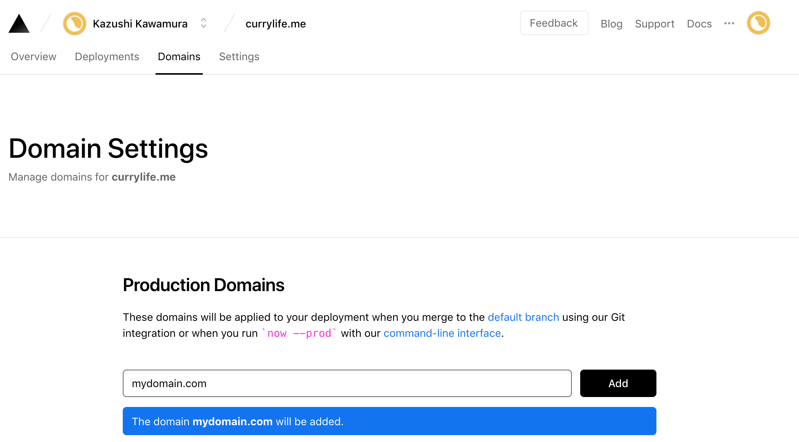
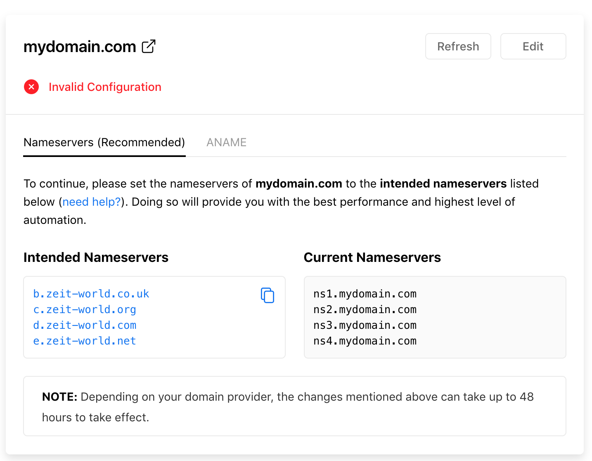
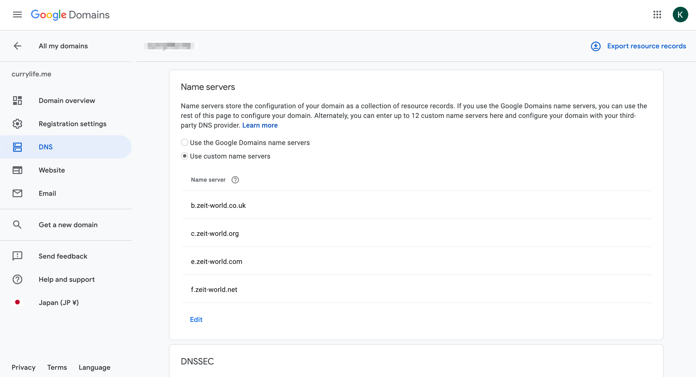

## Prerequisite

I have a frontend application running using [nextjs](https://nextjs.org/), and a GraphQL server written in Node.

Currently I have the frontend deployed on [now](https://zeit.co/home), and the API running on [heroku](http://heroku.com/)

I wanted to setup a custom domain, so that my frontend application will run on `mydomain.com` and the api running on `api.mydomain.com`.

So, I bought a domain on Google Domain.

## First, Setting up `now`'s domain

So first, setting up domain for my frontend application.

In the domain section of `now`s dashboard, you can easily add your custom domain.



Then, you will need to configure the domain, and there are 2 ways.

1. Changing the nameservers to zeit-world
2. Change the ANAME to alias to zeit-world

But if you choose Google Domain, **the first option** is the only option, since ANAME is not allowed in Google Domain, (and probably most of the Domain hosting services).



So in your google domain dashboard, you will need to change the Nameserver to the one provied from `now`.



🚀 Done.

## Setting up custom domain for Heroku.

If you are using, google domain it will very simple. You will just need to add uri provided from heroku and chuck it in the CNAME record.

But one small problem, is that you change the Nameserver to `now`, so you have to configure via `now`.

However `now` doesn't provide any fancy dashboard for DNS configuration, unlike Google Domain.

So..

You have to do it from the command line.

First download CLI.

```bash
yarn add global now@latest
```

Then login.

```bash
now login
```

You can check and the current configuration of your DNS.

```bash
now dns
```

And finally to add the CNAME, it will be like this.

```bash
now dns add currylife.me api CNAME hidden-horse-blabalabla.herokudns.com
```

🚀Done.

## Summary

In the end, being able to configure in the command line was quite simple.

Though I was used to the fancy dashboard.
