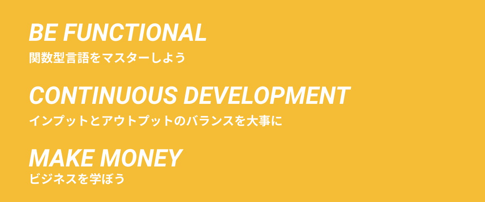

Last year I wrote about [my Personal Goal for 2019](/20181226-goals/) and it was my first time I wrote it in public.

And this has been a great milestone, and it made me try to make this year more meaningful.

This year I wanted to focus on **3** things.

1. To become a functional programmer - _Be Functional_
2. To continue self development - _Continuous Development_
3. To learn business and make money - _Make Money_

## Be Functional

In 2019, I learned a lot about functional programming, especially by using [elm](https://elm-lang.org/) in production plus to be lucky enough to have a professional functional programmer as my co-worker.

I have successfully entered the darkness and the beauty of functional programming.

There are so many interesting concepts, and impossible to just learn everything in one night. Functional Programming is an exciting mystery box for me.

And I want 2020 to be a year to go deep in functional programming concepts.

Specifically, `OCaml`, `F#` for general purpose programming, and `ReasonML`, `Purescript` for frontend development.

To become a functional programmer.

## Continuous Development

To improve my self has been my goal for quite a long time, and I want to continue with this mind set, and to **keep** what's being good for me.

But also to try new things.

### Reading Books as a Habit

Recently I bought Kindle Oasis, and it was the best thing I bought in 2019.

It has boost my productivity of reading, and removed many barrier of my reading habits.
I have read a couple of [books](/books), in 2 month, which is a super big improvement for me.

One of the important thing about reading is to **make it a habit**, to read a descent amount of books every week or every month. This you will let you find new things that you couldn't have met if you were not reading.

### Write Code Everyday

When I was reading [Soft Skills](https://www.amazon.com/dp/B0158SJ3EM/), I was introduced to this article, [Write Code Every Day](https://johnresig.com/blog/write-code-every-day/) by John Resig (author of jQuery). And claimed about the benefit of writing code everyday, to accomplish your life goals, and your hanging side-projects.

And if you look at his [github account](https://github.com/jeresig), you can see he literally continue making commits everyday for more 3 years.

### Presentation

I'll need to think about this more.

But I want to expand my output capability, and one great way is to make a presentation

## Make Money

In 2019, I made a lot of apps, figma / vscode plugins, and uploaded many blog posts. (You can see all my projects [here](/projects).)

But nothing made money, which was fine because that wasn't the purpose.

It also means, I know nothing about business and money.

In 2020, I want to start learning business and about money, and learn how to make money with my own knowledge and skills.

---

