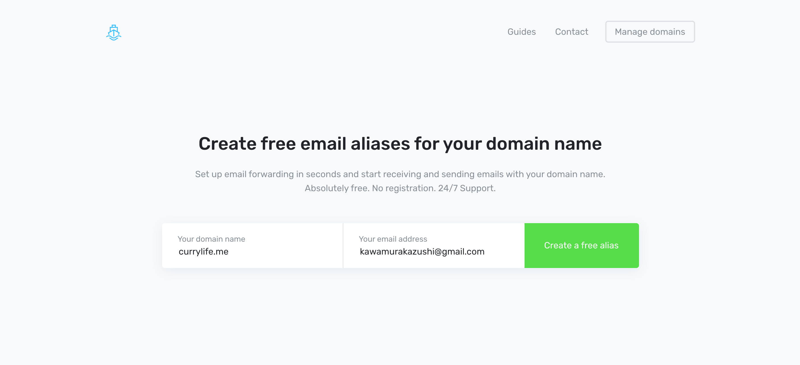
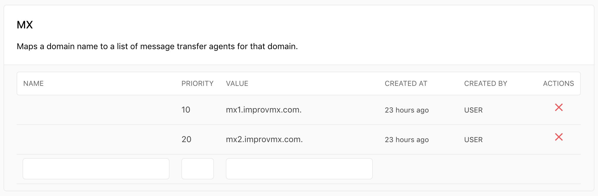

Now DNS doesn't have any support for mail servers. So unlike Google Domain you can't setup forwarding for specific email from your domain.

So you have to use a third party tool like [improvmx](https://improv.mx/) to configure forwarding.


## Setting up improvmx

Using improvmx is super simple, there's no registration, and you can use it immediately.

Go to the the top page (https://improv.mx/). And fill in your `domain name` and your `email` that you want to receive.



Click `Create a free alias`

You will receive email from improvmx to setup your MX record in your DNS.

## Setting MX record

You can just hit the following command and you are good to go.


```bash
now dns add <domain_name_here> '@' MX mx2.improvmx.com 20
now dns add <domain_name_here> '@' MX mx2.improvmx.com 20
```

If you don't want to use CLI, you can install the DNS integration [here](https://zeit.co/integrations/dns). You can easily add edit and remove your DNS configuration




## 🎉

Done!

Note that any email from that domain will be forwarding to your specified email. If you want to setup specific forwarding you'll need to start paying to improvmx.


## Reference

https://spectrum.chat/zeit/now/redirection-email-domain~b5e1b613-ae92-42f9-bc49-e8c824a8a7f2


