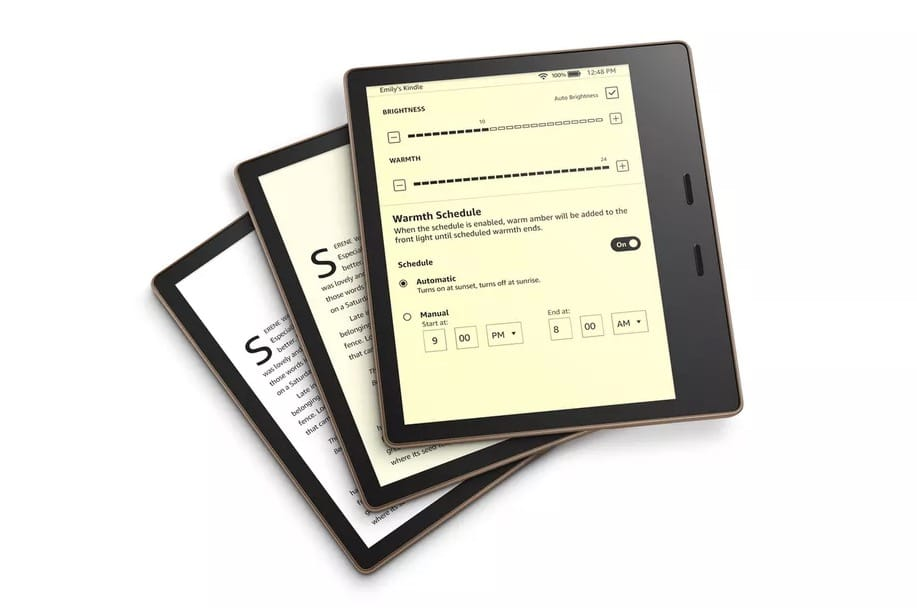

Recently I bought Kindle Oasis. It was the best thing I bought during 2019.

It has boosted my reading productivity and I read a lot of [books](/books) recently which is unbelievable before buying kindle.

And reading is becoming one my good habits.

I would like to note down what was good about kindle, and what still is a missing piece.

## Good 👍

### Buy anywhere and anytime

Now I don't waste my time going to the book store, and trying to find the book I want, but realizing the book is sold out.

You might think you can buy it on amazon, but you would at least wait for about a day for your book to arrive.

Normally when you want a book, you want to read it immediately, and I think it's important to start reading with that motivation.

With kindle you can buy it on amazon, download it and start reading. It's only a minute.

### Read anywhere

If you have Kindle with you, you don't have to think what book to put in your bag today.

It's all on the cloud.

### Kindle Highlight

Kindle Highlight is super useful. It's a magical highlights that you can check later and will be saved in the cloud.

### No physical books

I didn't realize this until I started using Kindle, but this was super effective. You don't have to mess around with your books in your room.

No need to sell it or throw your books away.

More space in your room.

### Light

It's important to be light, if you had to carry it every day 🎒

### Good For your eyes, No stress with E-ink

Before getting Kindle Oasis, I used the Kindle App on my iPhone. Functionality wise is was more than enough. But my gets tired quickly because of the small screen and the bright lights.

Kindle Oasis is big enough the E-Ink is great, and my eyes feel less tired.

### Can only do 1 thing

> Which is to read.

Concentration is very important while reading. No Notification and No Distractions while reading.

## Bad 👎

### Flipping through the book

This was the biggest issue why I didn't choose kindle for a long time. I like to flip through pages and get a overall understanding of the book immediately.

To do this it is physically and technically impossible.

I got used to it by reading the table of contents more, to get the overall idea of the book.

### Highlight accessibility

The amazon website where you can see all your highlight isn't that great.

Though the Mac application is not that bad, I wanted something more simple to look back and review my highlights.

At least I wanted an API, to fetch all my highlights...

## Summary

Thank you Kindle :D
