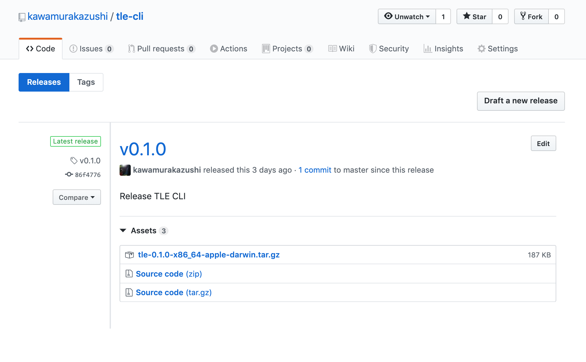

Recently I made a small CLI tool, which is a [TLE (Two-line elements) Parser.](https://github.com/kawamurakazushi/tle-cli).

_TLE is a data format encoding a list of orbital elements of an Earth-orbiting object for a given point in time._ ([Wikipedia](https://en.wikipedia.org/wiki/Two-line_element_set))

Something like this:

```
ISS (ZARYA)
1 25544U 98067A   20045.18587073  .00000950  00000-0  25302-4 0  9990
2 25544  51.6443 242.0161 0004885 264.6060 207.3845 15.49165514212791
```

and yes, it is human unreadable.

So I made a simple parser, and a cli to decode it to a JSON, to make it a _bit_ more human readable.

```json
{
  "argument_of_perigee": 264.606,
  "classification": "U",
  "drag_term": 0.000025302,
  "eccentricity": 0.0004885,
  "element_number": 999,
  "ephemeris_type": 0,
  "epoch": "20045.18587073",
  "first_derivative_mean_motion": 9.5e-6,
  "inclination": 51.6443,
  "international_designator": "98067A",
  "mean_anomaly": 207.3845,
  "mean_motion": 15.49165514,
  "name": "ISS (ZARYA)",
  "revolution_number": 21279,
  "right_ascension": 242.0161,
  "satellite_number": 25544,
  "second_derivative_mean_motion": 0.0
}
```

a bit better...

## Goal

So, I made this revolutionary CLI tool and wanted to publish this on [Homebrew](https://brew.sh/) for all mac users all over the world to use.

There were some small steps needed to follow, and I just wanted to note down the steps for the future me.

My goal was to let a user download like this:

```
brew tap kawamurakazushi/tap
brew install tle
```

### Notes

In order to remove the `brew tap` command, you need to send a PR to `homebrew-core` repository.
But there's obviously an approval policy. Rules like the number of github stars, to get it merged 😩.

## Steps

### Create a Binary file for Mac.

In rust, it's simple.

Normally the convention is `<package name>-<version>-<operating system>.tar.gz`.

```
cargo build --release
cd target/release
tar -czf tle-0.1.0-x86_64-apple-darwin.tar.gz tle
```

You'll need a hash number of this binary file later when publishing it to homebrew.

```
shasum tle-0.1.0-x86_64-apple-darwin.tar.gz
```

Run this command and keep the hash number.

### Create github release

Next create a github release, and upload the binary created.



### Create a new repository on Github for your tap

Next you'll need to create a github repository called `homebrew-<tap name>`, this is a convention you need to follow, to use the tap command.

```
brew tap <github account>/<tap name>
```

You can have multiple packages in one tap, so I just made `homebrew-tap`, to avoid making a `homebrew-bla` repository every time I want to publish it.

So in my case, it will be like this:

```
brew tap kawamurakazushi/tap
```

### Creating a Formula file

Create a file, in `Formula/tle.rb`.

```ruby
class Tle < Formula
  desc "CLI for parsing TLE (Two-line elements"
  homepage "https://github.com/kawamurakazushi/tle-cli"
  url "https://github.com/kawamurakazushi/tle-cli/releases/download/v0.1.0/tle-0.1.0-x86_64-apple-darwin.tar.gz"
  sha256 "a48c8347275c81a97a378bea61b38bf6a8bd3cad2fb7aa2a61ff483928374b15"
  version "0.1.0"

  def install
    bin.install "tle"
  end
end
```

You just need to replace the strings to match your pacakge.

You can see my whole repository here. https://github.com/kawamurakazushi/homebrew-tap

Done 👑

## Summary

Would like to make more CLI.

And please try my TLE Parser CLI 😂

```
brew tap kawamurakazushi/tap
brew install tle
```
