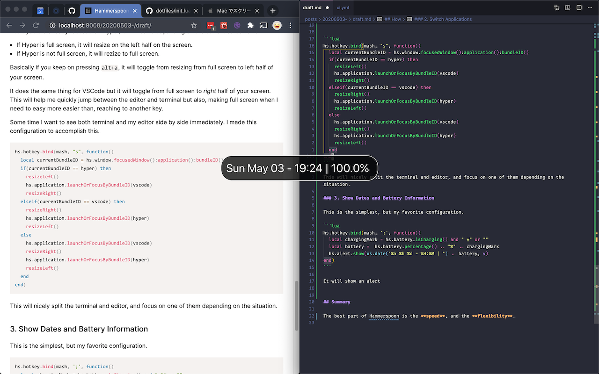

## Introduction

I have came across many window manager, using from ShiftIt, Spectacle, Rectangle, slatejs, yabai, and more, but so far Hammerspoon has been the best, in terms of speed, and flexibility.

I would like to introduce my Hammerspoon's current configuration.

## What can it do.

This is the list what it can do.

1. Resize Windows
1. Switch Applications
1. Show Dates and Battery Information

## How

Hammerspoon configuration uses a programming language called lua. It's not a difficult language, and you don't have to master the language to write the configuration.

### 1. Resizing window

This is the functions of resizing the windows.

It basically gets the currently focused `window`, and set the `frame` (size of the window) by using the `screen`'s frame, which is the size of your screen (or monitor).

```lua
local resizeFull = function()
  local win = hs.window.focusedWindow()
  local f = win:frame()
  local screen = win:screen()
  local max = screen:frame()

  f.x = 0
  f.y = 0
  f.w = max.w
  f.h = max.h
  win:setFrame(f, 0)
end

local resizeLeft = function()
  local win = hs.window.focusedWindow()
  local f = win:frame()
  local screen = win:screen()
  local max = screen:frame()

  f.x = 0
  f.y = 0
  f.w = max.w / 2
  f.h = max.h
  win:setFrame(f, 0)
end

local resizeRight = function()
  local win = hs.window.focusedWindow()
  local f = win:frame()
  local screen = win:screen()
  local max = screen:frame()

  f.x = max.x + (max.w / 2)
  f.y = max.y
  f.w = max.w / 2
  f.h = max.h
  win:setFrame(f, 0)
end

local resizeTop = function()
  local win = hs.window.focusedWindow()
  local f = win:frame()
  local screen = win:screen()
  local max = screen:frame()

  f.x = 0
  f.y = 0
  f.w = max.w
  f.h = max.h / 2
  win:setFrame(f, 0)
end

local resizeBottom = function()
  local win = hs.window.focusedWindow()
  local f = win:frame()
  local screen = win:screen()
  local max = screen:frame()
  f.x = 0
  f.y = max.h / 2
  f.w = max.w
  f.h = max.h / 2
  win:setFrame(f, 0)
end
```

These are just functions, so you want to bind it with a specific key combination. You do it by the `hs.hotkey.bind()` function, that hammerspoon provides.

```lua
local mash = { "alt" }

hs.hotkey.bind(mash, "h", resizeLeft)
hs.hotkey.bind(mash, "j", resizeBottom)
hs.hotkey.bind(mash, "k", resizeTop)
hs.hotkey.bind(mash, "l",  resizeRight)
hs.hotkey.bind(mash, "f", resizeFull)
```

So in this configuration, if you press `alt+f` the current window will turn full screen.

`mash` can be any modifier key. I'm mapping the _right shift_ to _alt_, so I'm actually pressing `right shift + f` for making the window full screen.

You can map specific key to other key by using [Karabiner Elements](https://karabiner-elements.pqrs.org/).

### 2. Switch Applications

Normally, applications you use in your daily basis is the same.
So I wanted to map a specific key to launch or focus the application, so I can graduate from repeated `cmd+tab`s.

This is super easy, since hammerspoon provides a wonderful function called `hs.application.launchOrFocus()` which is what I wanted to do.

```lua
local apps = {
  { key = "w", app = "google chrome" },
  { key = "q", app = "notion" },
  { key = "e", app = "slack" }
}

for i, object in ipairs(apps) do
  hs.hotkey.bind(mash, object.key, function()
    hs.application.launchOrFocus(object.app)
  end)
end
```

🎉 Nice and Simple.

But for my developing environment I wanted to do something different and not just focusing the application but also resizing the window depending on the current situation.

I use [Hyper](https://hyper.is/) for my terminal, and VSCode as an editor.

I wanted something _tmux like_ experience switching between the terminal and my editor.
And this is my current solution, but I'm still seeking for a better solution.

```lua
local hyper = "co.zeit.hyper"
local vscode = "com.microsoft.VSCode"

local dev = {
  { key = "a", bundleID = hyper },
  { key = "d", bundleID = vscode}
}

for i, object in ipairs(dev) do
  hs.hotkey.bind(mash, object.key, function()
    local bundleID = object.bundleID
    local beforeBundleId = hs.window.focusedWindow():application():bundleID();

    hs.application.launchOrFocusByBundleID(bundleID)
    local win = hs.window.focusedWindow()

    local frame = win:frame()
    local max = win:screen():frame()
    local isFull = frame.w == max.w and frame.h == max.h

    local isSame = beforeBundleId == bundleID

    if(isFull and isSame) then
      if(bundleID == hyper) then
        resizeLeft()
      elseif(bundleID == vscode) then
        resizeRight()
      end
    else
      if(isSame) then
        resizeFull()
      end
    end
  end)
end
```

What this does is, if I press `alt+a` from a application that is not Hyper, it will focus Hyper.

But it you are already focused on Hyper, it will resize depending on the current screen size.

- If Hyper is full screen, it will resize on the left half on the screen.
- If Hyper is not full screen, it will rezize to full screen.

Basically if you keep on pressing `alt+a`, it will toggle from resizing from full screen to left half of your screen.

It does the same thing for VSCode but it will toggle from full screen to _right_ half of your screen.
This will help me quickly jump between the editor and terminal but also, making full screen when I need to easy more easier than, reaching to another key.

Some time I want to see both terminal and my editor side by side immediately. I made this configuration to accomplish this.

```lua
hs.hotkey.bind(mash, "s", function()
  local currentBundleID = hs.window.focusedWindow():application():bundleID()
  if(currentBundleID == hyper) then
    resizeLeft()
    hs.application.launchOrFocusByBundleID(vscode)
    resizeRight()
  elseif(currentBundleID == vscode) then
    resizeRight()
    hs.application.launchOrFocusByBundleID(hyper)
    resizeLeft()
  else
    hs.application.launchOrFocusByBundleID(vscode)
    resizeRight()
    hs.application.launchOrFocusByBundleID(hyper)
    resizeLeft()
  end
end)
```

This will nicely split the terminal and editor, and focus on one of them depending on the situation.

### 3. Show Dates and Battery Information

This is the simplest, but my favorite configuration.

```lua
hs.hotkey.bind(mash, ';', function()
  local chargingMark = hs.battery.isCharging() and " *" or ""
  local battery =  hs.battery.percentage() .. "%" .. chargingMark
  hs.alert.show(os.date("%a %b %d - %H:%M | ") .. battery, 4)
end)
```

It will show an alert of the current date time, and the battery information.

Why is this so useful? It's because I hide the menu bar of the mac, so in order to check the time or the battery, I needed to move my mouse to the top to check.

But if you have this command I can check it with a simple key bind.



## Summary

The best part of Hammerspoon is the **speed**, and the **flexibility**.

Window tiling manager like ShiftIt, Spectacle, and Rectangle are fast, but not enough flexibility.

And application like [yabai](https://github.com/koekeishiya/yabai) + [skhd](https://github.com/koekeishiya/skhd), and [slate](https://github.com/ianstormtaylor/slate) are super flexible, but not fast enough.

Overall In my current opinion Hammerspoon, is the most well balanced application, and fitted my needs.

If for you want to see my full configuration you can check my github repository:
https://github.com/kawamurakazushi/dotfiles/blob/master/.hammerspoon/init.lua

Thanks for reading!
