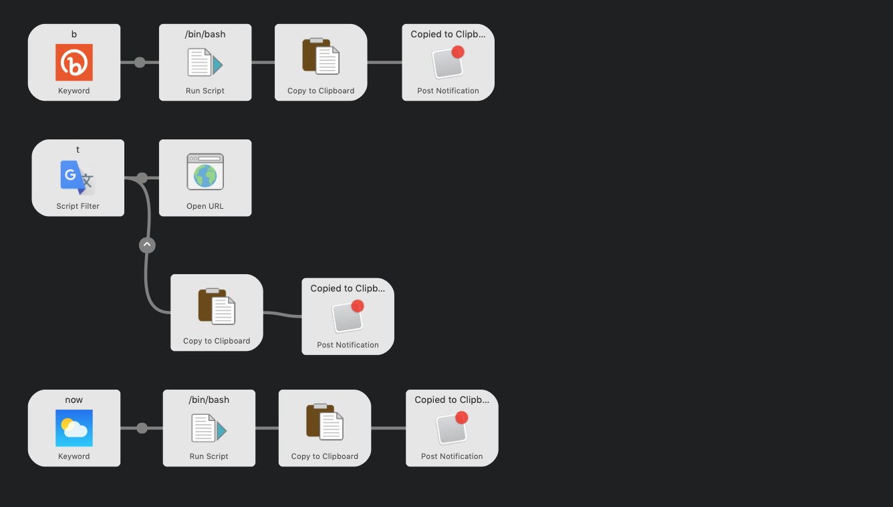
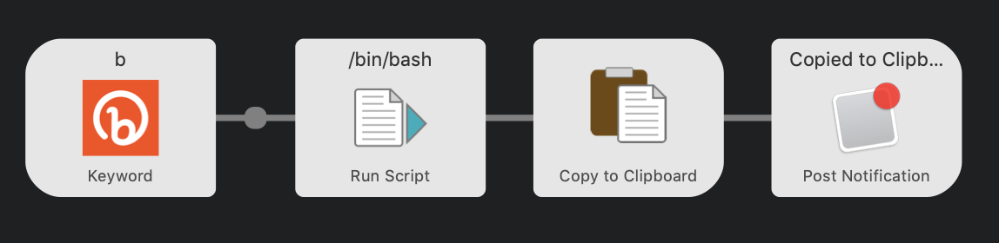
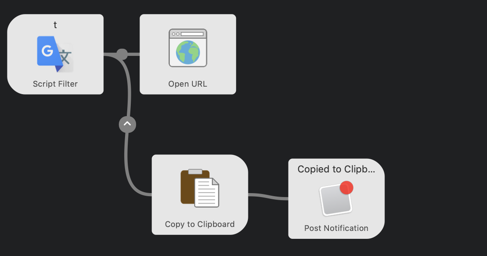

## Introduction

[Alfred](https://www.alfredapp.com/) is one of my favorite productivity tool.

It's a launcher for MacOS, used by many people as a replacement of Spotlight.

There are many features in Alfred, but one of the powerful feature is the Workflow.

You can combine hotkeys, keywords and action together to create your own original workflow.



I would like to introduce some of my workflows, that I extensively use daily.

1. URL Shortener
2. Translating from Japanese to English and vice versa.
3. Pasting current date

## URL Shortener

I use URL Shortener a lot. To shorten super long amazon links, or even to track how many people has actually clicked on it.

[Bitly](https://app.bitly.com/bbt2/) is one of the most famous URL Shortener.

It also provides API and anyone who has an account can use it for a certain amount. I will be using the API to connect Alfred and Bitly.

### Requirements

- [httpie](https://httpie.org/)

I just used it as a replacement for curl, it saves couple of keystrokes.

- [jq](https://github.com/stedolan/jq)

To parse json values, returned from Bitly API.

- [Bitly Access Token](https://support.sendible.com/hc/en-us/articles/360021876751-How-To-Access-Your-Bit-ly-Key-)

To use the Bitly API.

### Implementation



This work flow will be triggered when I type `b` on Alfred, with the argument (Long URL) and pass the URL to Run Script as an argument.

Run Script is where you can write bash script, and basically do anything.

```bash
export PATH=/usr/local/bin/:$PATH

http POST 'https://api-ssl.bitly.com/v4/shorten' \
  Authorization: 'Bearer <your bitly access token here>' \
  long_url="$1" --ignore-stdin \
  | jq '.link'
  | tr -d '"'
```

What this does is first, it uses the bitly API to shorten the URL. This will return a JSON something like this:

```json
{
  "archived": false,
  "created_at": "2020-05-01T11:23:36+0000",
  "custom_bitlinks": [],
  "deeplinks": [],
  "id": "bit.ly/2YkrG8F",
  "link": "https://bit.ly/2YkrG8F",
  "long_url": "https://www.google.com/",
  "references": {
    "group": "https://api-ssl.bitly.com/v4/groups/Bk51blb4Dcx"
  },
  "tags": []
}
```

But I just want the `link` field. So I can use `jq` to get the field out from the json by piping `| jq '.link'`.
This will return something like this:

```
"https://bit.ly/2YkrG8F"
```

`jq` is super useful, but I don't need the quotes around, so just used the builtin `| tr -d '"'` to remove the quotes around

```
https://bit.ly/2YkrG8F
```

This stdout will be passed to the next workflow which is **Copy to Clipboard**, and then to **Push Notification**, to notify me when it's done.

## Translator

I'm a Japanese, and I'm not a native English speaker. So it's very common to search for English words I don't know, and also translating Japanese to English.

I wanted to automate this.

### Requirements

- [translate-shell](https://github.com/soimort/translate-shell)

This is shell commands, which basically wraps the Google Translate API.

### Implementation



The flow is almost the same as the URL Shortener Workflow, but Script it well will be obviously different.

```bash
PATH=$PATH:/usr/local/bin

TRANS= ''
re='[a-zA-Z]';

if [[ "{query}" =~ $re ]]; then
	TRANS=`trans :ja -b "{query}"`
else
	TRANS=`trans -b "{query}"`
fi

cat << EOB
{
	"variables": {
		"input": "{query}",
		"output": "${TRANS}",
		"prefix": "ja2en"
  	},
	"items": [
		{
			"uid": "eg1",
			"title": "${TRANS}",
			"subtitle": "{query}",
			"arg": "${TRANS}"
		}
	]
}
EOB
```

If I type Japanese I wanted to translate it to English, and if I type English I wanted to translate it to Japanese.

So this will check the query and identify if its using alphabet or other character (in this case Japanese).
And depending on that the command of the `translate-shell` will be slightly different.

and what `cat` does is to print JSON, which is specified by Alfred, and this will make list for you under the search box.


If you look at the workflow, there is two routes, after running the script. This depends on what I press after.

`Enter` will open URL on a browser, jump to a website where a can see more specific translation.

`Shift+Enter` will copy the translation to the clipboard.

## Paste Date


This is a simple one.

It will copy and paste a formatted date. I use this everyday to write daily logs, so it will save few seconds everyday to automate this.

```bash
date "+%Y/%m/%d (%a)"
```

The output will be something like this:

```
2020/05/06 (Wed)
```

## Summary

Alfred is great.

You can automatic a lot of things, and you can call alfred from any application accomplishing everything on the keyboard.
