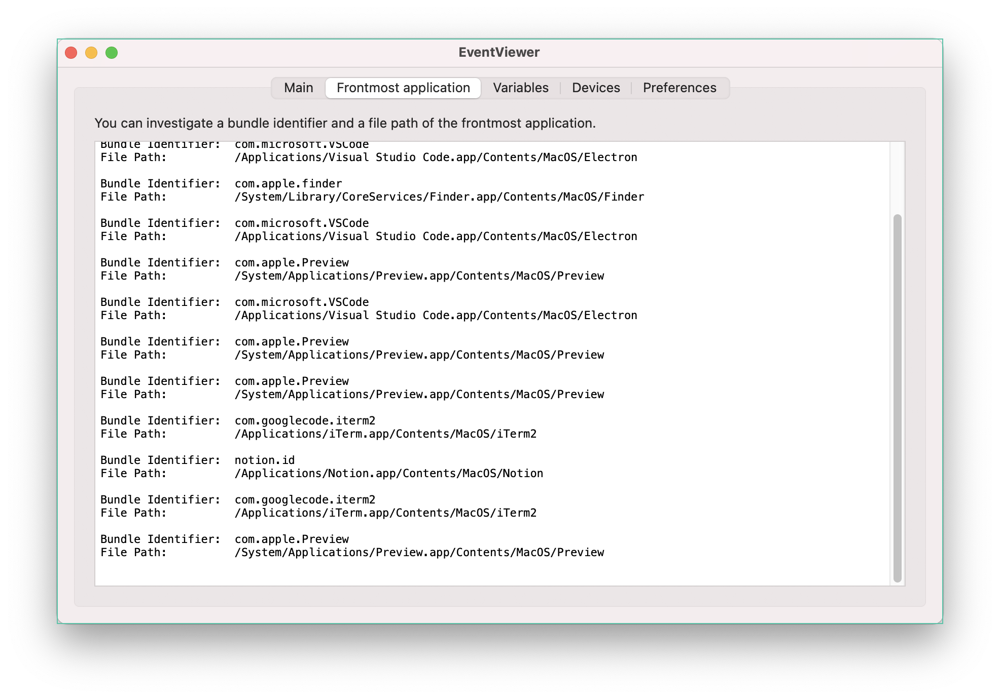

## Introduction

I like [Notion](https://www.notion.so/), I'm using it for quite along time. But one thing that I dislike is the lack of emacs-like keybinding.
Dropbox Paper does a bit better, and I like the user experience more.

Especially `ctrl+h`.

It does remove characters, but it will not remove symbols (like bullet points) and line, so I will always get stuck at the start of the line when I want to remove the whole line.

So I had to find the way.

## Solutions

As a mac user, I use [Karabiner](https://karabiner-elements.pqrs.org/) for key maps configuration.

So I decided to map my `ctrl+h` to `backspace`.

And to do so I need to tweak a little in my `~/.config/karabiner/karabiner.json` file.

```json
{
  "profiles": [
    {
      "complex_modifications": {
        "rules": [
          {
            "manipulators": [
              {
                "description": "ctrl+h -> backspace",
                "from": {
                  "key_code": "h",
                  "modifiers": { "mandatory": ["control"] }
                },
                "to": [
                  {
                    "key_code": "delete_or_backspace"
                  }
                ],
                "type": "basic"
              }
            ]
          }
        ]
      }
    }
  ]
}
```

It's very simple and descriptive.

One problem is I didn't want to map it on all application, despite it might cause some other bug or unexpected things.

In this case I can add a `conditions` field to do so, saying if the front most application is notion (bundle id = notion.id) please apply this key mapping.

```json{20-25}
{
  "profiles": [
    {
      "complex_modifications": {
        "rules": [
          {
            "manipulators": [
              {
                "description": "ctrl+h -> backspace",
                "from": {
                  "key_code": "h",
                  "modifiers": { "mandatory": ["control"] }
                },
                "to": [
                  {
                    "key_code": "delete_or_backspace"
                  }
                ],
                "type": "basic",
                "conditions": [
                  {
                    "type": "frontmost_application_if",
                    "bundle_identifiers": ["^notion\\.id"]
                  }
                ]
              }
            ]
          }
        ]
      }
    }
  ]
}
```

And tada !


## Tips

If you want to know the bundle identifer of an app _Karabiner EventViewer_ is useful.

It will tell you the bundler identifier of the front most application that you are focused on.




